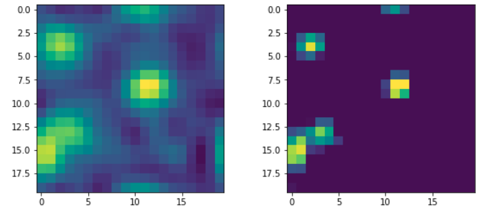

# DeepSofi
Project to extend super-resolution SOFI methods with deep learning

Ongoing work....

## Main idea

We are trying to resolve single emitters in the FOV obtained by a microscope and reconstruct the full image with superresolution. Instead of typical methods using 2d gaussian fits, we rely on temporal fluctuations of the signal (thus the reference to SOFI) to extract the PSF of the emitter, without assuming anything about the structure of the optical fluctuations.

